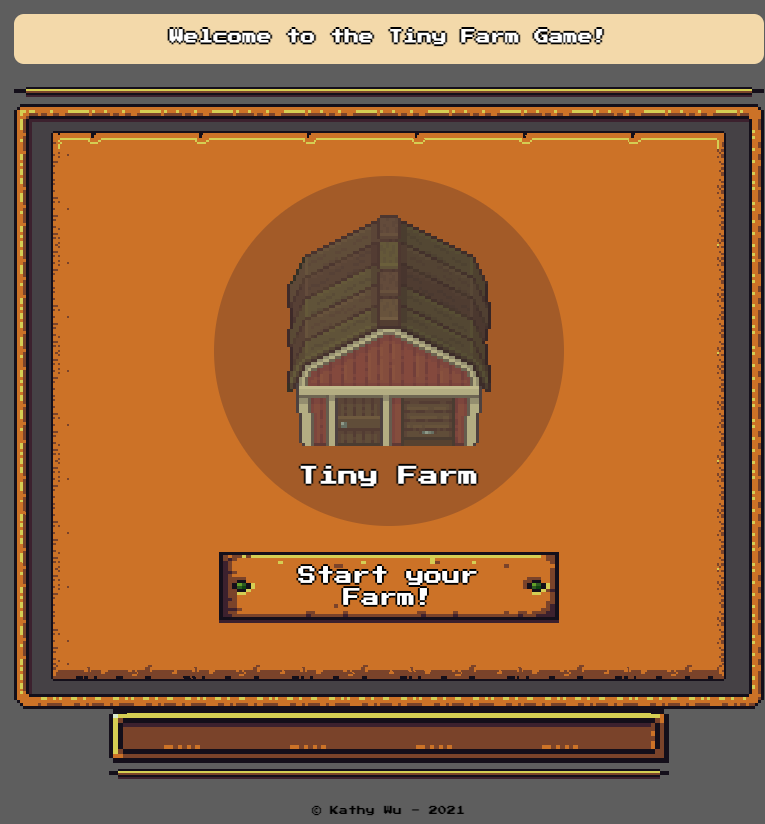
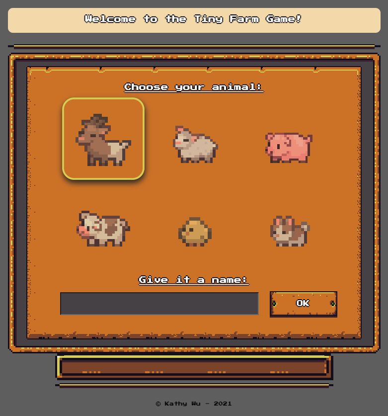
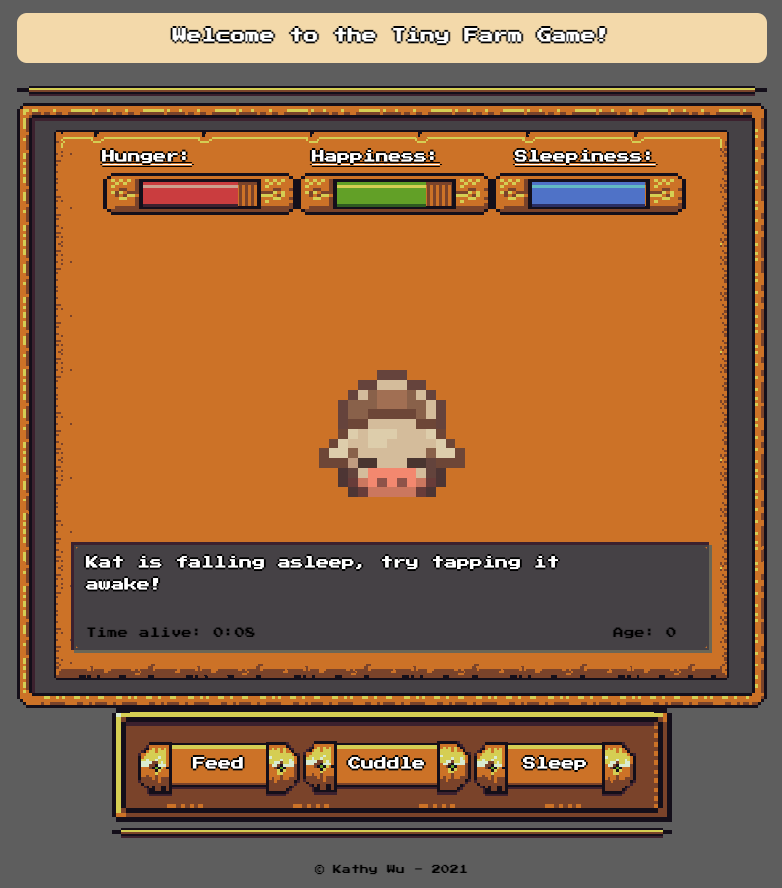
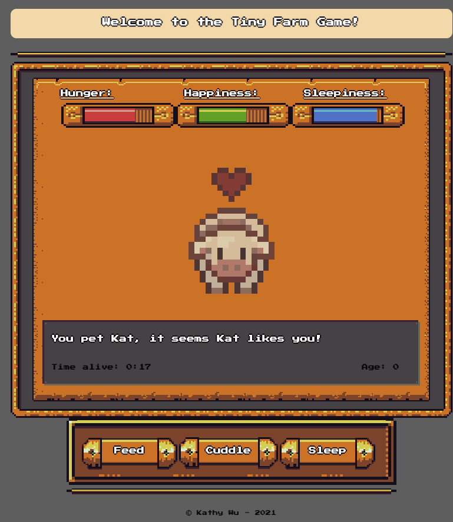
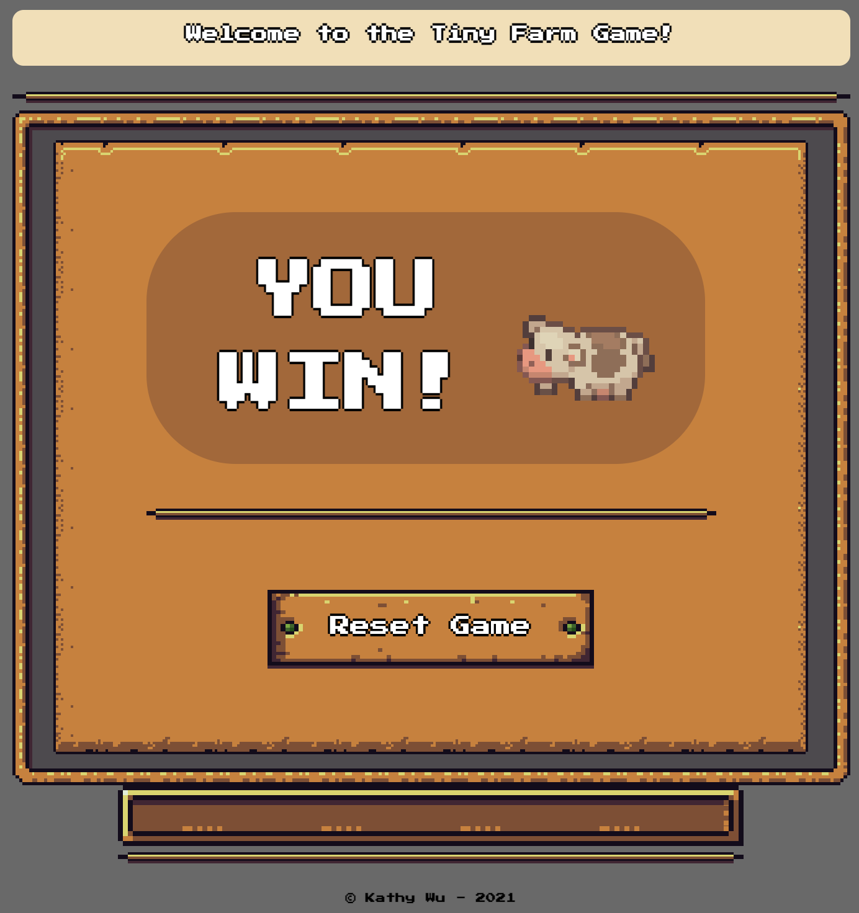
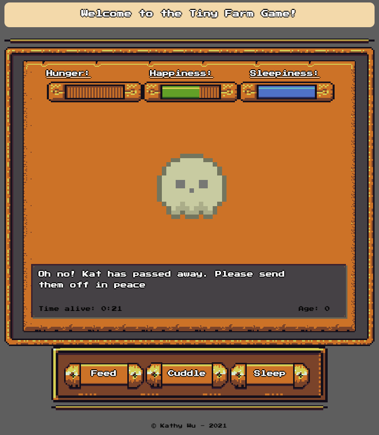
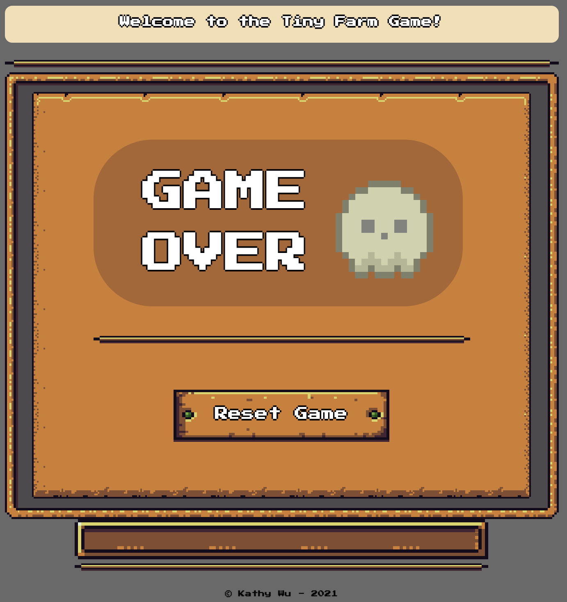
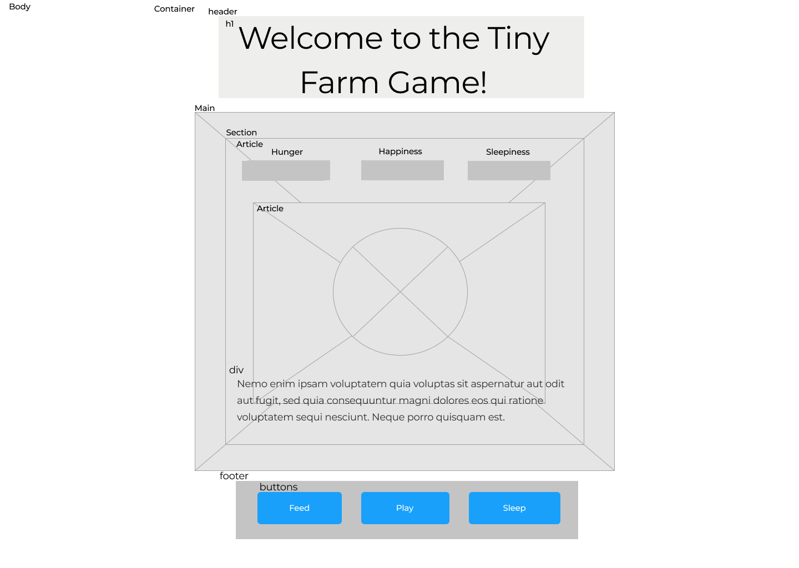

# Project-Tiny-Farm
> Craft a tiny farm by raising one of six animals: goat, sheep, pig, cow, chicken, and bunny. Try to keep your animal alive for 5 minutes through feeding, petting, cuddling, and putting it to sleep. If any of the meters reach zero, your animal will pass away. 
> Live demo [_here_](https://kathyswu.github.io/Project-Tiny-Farm/).

## Table of Contents
* [General Info](#general-information)
* [Version](#version)
* [Features](#features)
* [Screenshots](#screenshots)
* [User Stories](#user-stories)
* [Wireframe](#wireframe)
* [Room for Improvement](#room-for-improvement)
* [Acknowledgements](#acknowledgements)
* [Contact](#contact)

 

## General Information
- This project was created as a first project for the Software Engineering Immersive Program at General Assembly
- The purpose of this project was to reproduce a game mechanic (inspired by the &copy;Tamagotchi) of using timers to showcase the pet's current state and trying to keep it alive through actionable items that increment the pet's hunger, happiness, and sleepiness stats.

 

## Version
- Tiny Farm - version 1.0

## Features
The current features:
- Choose the type of farm animal you want to raise
- Six different options: goat, sheep, pig, cow, chicken, bunny
- Name your farm animal
- Feed, Cuddle, Pet, and make your animal go to sleep
- Timer counts how long the animal has been alive
- The animal morphs as it ages from a baby to an adult
- The animal shows different animations and message for each actionable item
- The animal changes into a ghost upon death
- Endgame screens feature the ability to reset game and play from the beginning

## Screenshots

## User Stories

1. When the user loads the game, they are greeted with a start menu that populates the button to start the game.

2. When the user presses the start button, the game screen transitions into a screen asking for the user to choose one of six farm animals by clicking on their associated picture (chicken, bunny, cow, goat, sheep, pig). Upon clicked, the animal's icon will light up and the user must enter a name for the animal in an input-field. The user must enter a valid name (not empty string) for the confirm button to work and bring them to the game screen.

3. After submitting, the screen will transition to the game screen showcasing revealing the baby animal who is sleeping. The user may wake the animal by clicking on the image of it. The timer on the message section will show time kept alive and start counting up, the age of the animal will start at 0 and increment over time as well. 

4. Upon reveal, the hunger, happiness, and sleepiness meters of the animal appears along with 3 new buttons on the bottom of the screen (feed, cuddle, and sleep). The meters begin to decrease by different rates and the user must interact with the buttons in order to feed, cuddle, and make the animal go to sleep. When the buttons are pressed, the corresponding metric to the actionable button will increase depending on the type of animal.

5. As the time passes and the animal will be animated across the screen, moving left and right. While the animal is still alive, the animal will start growing (two stages: baby -> adult), 3 minutes of being kept alive the animal will grow to full adult size.

6. If animal is kept alive in adult size for 2 more minutes (total game time and time kept alive reaches 5 minutes), then the game will be over and the animal will be sent to a loving barn, so the player gets the Game Over - Successful screen and can choose to raise another animal by pressing the reset game button.

7. At any point if the hunger, sleep, or happiness, meter reaches 0, the animal passes away and the Game over - RIP screen appears where the player can press the reset game button to reset the entire game from the beginning.

## Wireframe

## Project Status
> <h4> <strong>Complete</strong></h4>

## Room for Improvement

Room for improvement:
- DRY code
- Clean up CSS
- Better form validation on name input

To do:
- Have multiple animals
- Introduce scoring functionality
- Have barn where animals are sent to successfully add points to score
- Add sound effects and music

## Acknowledgements
Credits to Licenses and Assets Used:
- RPGUI by [RonenNess](https://github.com/RonenNess/RPGUI)
- Cozy Farm Asset Pack by [Shubibubi](https://shubibubi.itch.io/cozy-farm)
- Google Fonts
- jQuery
- and many thanks to Jake, my number one supporter!

## Contact
Created by [@kathyswu](https://github.com/kathyswu) - feel free to contact me!
